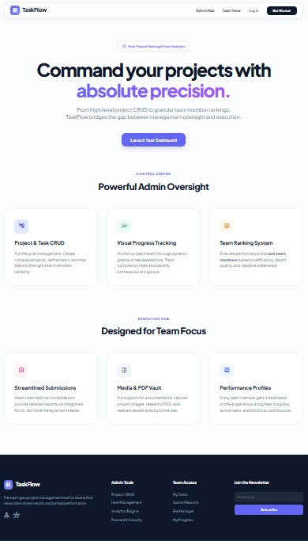
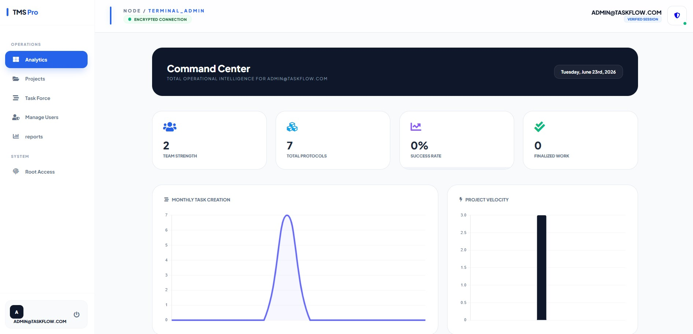
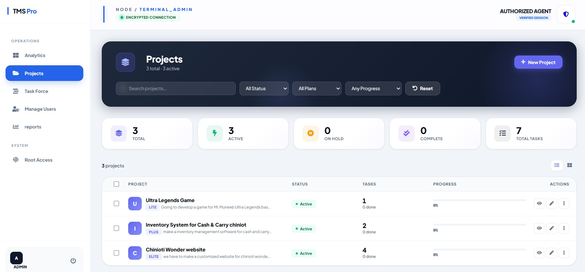
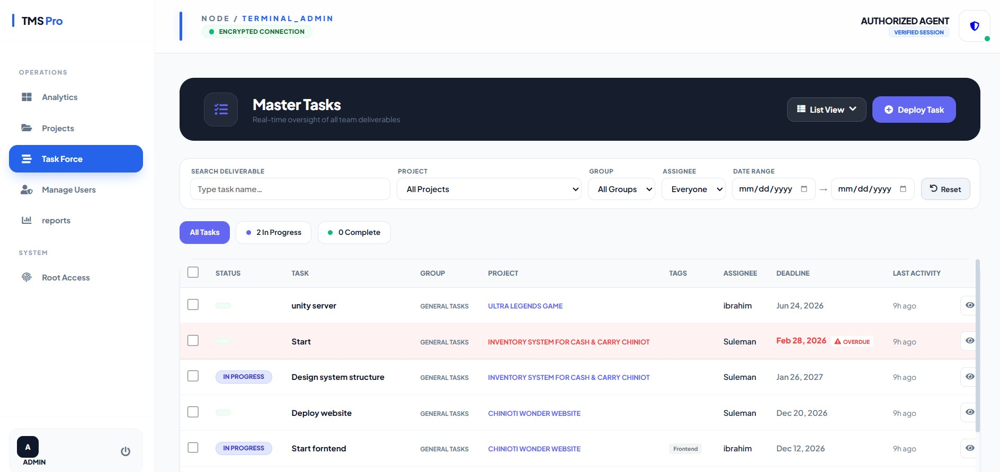
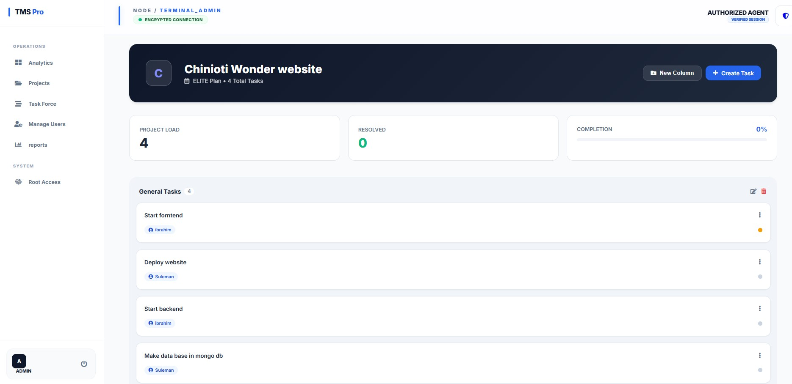
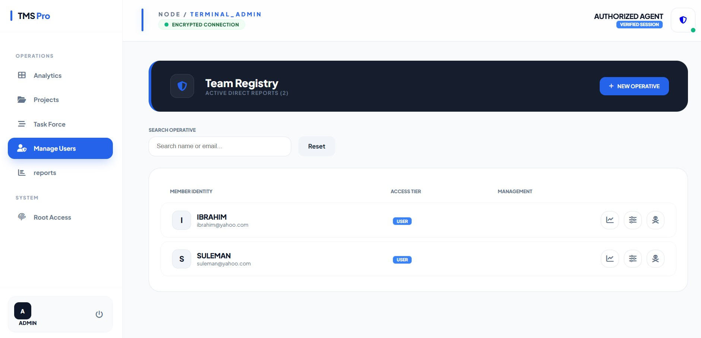
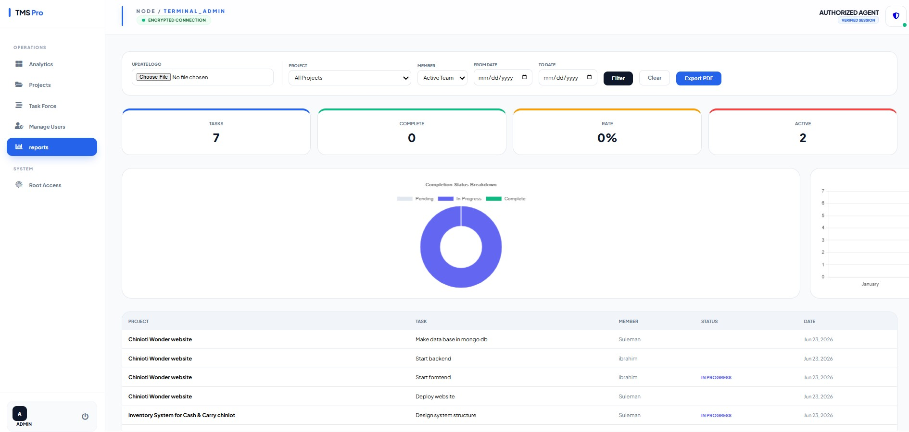
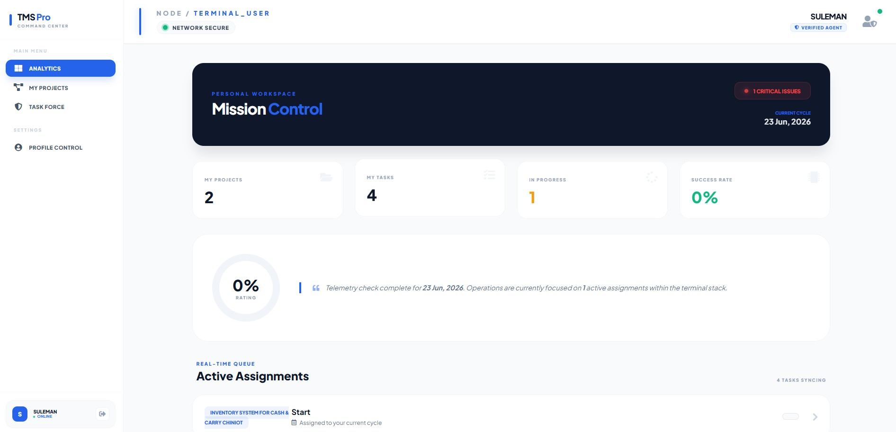

<div align="center">


# TMS Pro — Task Management System

**A full-stack web application for managing projects, tasks, and teams with role-based dashboards, analytics, and performance tracking.**

[](https://php.net)
[](https://mysql.com)
[](https://developer.mozilla.org/en-US/docs/Web/JavaScript)
[](https://developer.mozilla.org/en-US/docs/Web/CSS)
[](https://chartjs.org)
[](LICENSE)

</div>

---

## 📌 Overview

**TMS Pro** (TaskFlow) is a full-stack PHP/MySQL task management system built for teams. It features a dual-panel architecture — a powerful **Admin Control Center** and a focused **User Execution Hub** — allowing administrators to create projects, assign tasks, and track team performance, while users manage their personal workload and submit updates.

The system runs entirely on a standard LAMP/XAMPP stack with no external frameworks — clean PHP, PDO, vanilla JavaScript, and custom CSS throughout.

---

## ✨ Features

### 🛡️ Admin Panel — "Command Center"

| Feature | Details |
|---|---|
| **Dashboard** | Real-time stats: team strength, total tasks, success rate, completed tasks. Animated counters, monthly task trend chart (line), project velocity chart (bar) via Chart.js |
| **Performance Leaderboard** | Ranks team members by completed tasks with visual progress bars |
| **Project Management** | Full CRUD — create, edit, delete projects. Filter by status (Active / On Hold / Complete), plan type, and progress. List & Grid view toggle |
| **Task Management** | Create tasks with title, description, project, assignee, due date, status, tags, group name, and file attachment. Bulk actions: delete, mark complete, set in-progress |
| **User Management** | Add, edit, delete team members. Admin can only manage users they created (isolated data per admin) |
| **Reports & Intelligence** | Filter task reports by team member, project, and date range. Displays task status breakdown with Chart.js pie chart. Custom logo upload for reports |
| **Profile Management** | Admin can update username, email, password. Profile picture upload with base64 crop & save |
| **User Profile View** | Admin can view any team member's profile page with their task history |

### 👤 User Panel — "Execution Hub"

| Feature | Details |
|---|---|
| **Dashboard** | Personal stats: assigned projects, total tasks, in-progress count, success rate, overdue tasks |
| **My Tasks** | View all assigned tasks ordered by due date. Update task status |
| **My Projects** | View projects the user is assigned to |
| **View Project** | Kanban-style grouped task view per project |
| **Profile** | User can manage their own profile details |

### 🔐 Authentication System

- Login via **email or username**
- `password_hash()` / `password_verify()` — bcrypt password security
- Session-based role routing: Admin → `/admin/dashboard.php`, User → `/user/dashboard.php`
- `requireLogin()` and `requireRole()` middleware on every protected page
- Signup with email validation and duplicate check

---

## 🗄️ Database Schema

Three core tables with proper foreign key constraints:

```sql
users        → id, username, email, password (hashed), role (admin/user),
               profile_pic, created_by_admin, created_at

projects     → id, project_name, description, status (active/completed/on_hold),
               assigned_date, plan_type, display_order, created_by_admin, created_at

tasks        → id, project_id (FK→projects), group_name, title, description,
               status (in_progress/review/done), due_date, assigned_to (FK→users),
               created_by_admin (FK→users), attachment, tags, updated_at, created_at
```

**Key design decisions:**
- `ON DELETE CASCADE` on `tasks.project_id` — deleting a project removes all its tasks
- `ON DELETE SET NULL` on `tasks.assigned_to` — deleting a user preserves task history
- Every admin's data is isolated via `created_by_admin` — multiple admins can use the same system independently

---

## 🛠️ Tech Stack

| Layer | Technology |
|---|---|
| Backend | Core PHP 8.x |
| Database | MySQL 8.x via PDO |
| Frontend | HTML5, CSS3, Vanilla JavaScript (ES6) |
| Charts | Chart.js (CDN) |
| Icons | Font Awesome 6 (self-hosted) + Google Material Symbols |
| Fonts | Plus Jakarta Sans (Google Fonts) + DM Mono |
| Server | Apache via XAMPP |

---

## 📂 Project Structure

```
tms_pro/
├── index.php                  # Landing page (TaskFlow homepage)
│
├── auth/
│   ├── login.php              # Login (email or username)
│   ├── signup.php             # Registration
│   └── logout.php             # Session destroy & redirect
│
├── admin/                     # Admin-only pages (requireRole('admin'))
│   ├── dashboard.php          # Command Center — stats, charts, leaderboard
│   ├── projects.php           # Project list with filters and stats
│   ├── add_project.php        # Create new project
│   ├── edit_project.php       # Edit project details
│   ├── delete_project.php     # Delete project (cascades tasks)
│   ├── bulk_delete_projects.php
│   ├── view_project.php       # Grouped Kanban view — quick add/edit/delete tasks
│   ├── all_tasks.php          # All tasks table with bulk actions & filters
│   ├── add_task.php           # Create task (project, assignee, tags, attachment)
│   ├── edit_task.php          # Edit task with file upload
│   ├── delete_task.php
│   ├── view_task.php          # Task detail + inline edit (admin)
│   ├── manage_users.php       # Team Registry — list, search, delete users
│   ├── add_user.php           # Create team member
│   ├── edit_user.php          # Edit team member
│   ├── delete_user.php
│   ├── reports.php            # Intelligence Report — filters, charts, logo upload
│   ├── profile.php            # Admin own profile (pic crop, password change)
│   ├── user_profile.php       # View any team member's profile
│   └── admin_settings_1.json  # Persistent report logo config (per admin)
│
├── user/                      # User-only pages (requireLogin())
│   ├── dashboard.php          # Personal stats & active assignments
│   ├── my_tasks.php           # All assigned tasks
│   ├── projects.php           # Projects user is assigned to
│   ├── view_project.php       # Project's tasks from user perspective
│   ├── update_task.php        # Update task status
│   └── profile.php            # User profile management
│
├── includes/
│   ├── admin_sidebar.php      # Admin navigation sidebar
│   ├── admin_header.php       # Admin top header bar
│   ├── user_sidebar.php       # User navigation sidebar
│   └── user_header.php        # User top header bar
│
├── config/
│   └── db.php                 # PDO connection + requireLogin() + requireRole()
│
├── database/
│   └── init.sql               # Full schema — users, projects, tasks tables
│
├── assets/
│   ├── img/uploads/           # Logo and profile image uploads
│   └── js/
│
├── uploads/
│   ├── attachments/           # Task file attachments
│   └── profiles/              # User profile pictures
│
└── fontawesome/               # Self-hosted Font Awesome 6
```

---

## ⚙️ Installation & Setup

### Prerequisites

- [XAMPP](https://www.apachefriends.org/) (Apache + MySQL + PHP 8.x)
- Git

### Step-by-Step

**1. Clone the repository**
```bash
git clone https://github.com/ibrahimabbas1721-dev/Task-Management-System.git
```

**2. Move to XAMPP htdocs**
```bash
# Windows
move Task-Management-System C:\xampp\htdocs\tms_pro

# macOS / Linux
mv Task-Management-System /opt/lampp/htdocs/tms_pro
```

**3. Import the database**
- Start Apache and MySQL from the XAMPP Control Panel
- Open [http://localhost/phpmyadmin](http://localhost/phpmyadmin)
- Create a new database named **`pro`**
- Select the `pro` database → click **Import** → choose `database/init.sql` → click **Go**

**4. Configure database connection** *(only if your credentials differ)*

Open `config/db.php` and update if needed:
```php
$host     = 'localhost';
$dbname   = 'pro';
$username = 'root';
$password = '';   // Set your MySQL password here
```

**5. Create required upload directories** *(if not already present)*
```
tms_pro/uploads/attachments/
tms_pro/uploads/profiles/
```

**6. Open in browser**
```
http://localhost/tms_pro/
```

---

## 🚀 Usage

### First-Time Setup

1. Go to `http://localhost/tms_pro/auth/signup.php`
2. Register an **Admin** account (select role: Admin)
3. Log in — you'll be redirected to the **Admin Command Center**
4. From **Manage Users**, add team members (they register as `user` role)
5. Create **Projects**, then create **Tasks** and assign them to team members

### User Login

Team members log in at `http://localhost/tms_pro/auth/login.php` and are routed to their personal **Execution Hub** dashboard.

---

## 🖼️ Screenshots

### Landing Page
> TaskFlow homepage with feature overview and Get Started CTA.



### Admin — Command Center (Dashboard)
> Real-time stats, monthly task trend, project velocity chart, and performance leaderboard.



### Admin — Projects
> Project list with status filters, plan filter, progress filter, and stat tiles.



### Admin — All Tasks
> Full task table with bulk actions (delete, complete, in-progress), search, and status filters.



### Admin — View Project (Kanban)
> Grouped task board — quick add, inline edit, drag-style status update per task.



### Admin — Manage Uers 
> Admin can manage the users and monitor individual user progress.



### Admin — Intelligence Report
> Filterable task report by user, project, and date range with Chart.js status breakdown.



### User — Execution Hub
> Personal dashboard showing assigned projects, task counts, success rate, and overdue tasks.



> *(Add your actual screenshots to `screenshots/admin/` and `screenshots/user/` and update paths above)*

---

## 🔒 Security

- All database queries use **PDO prepared statements** — SQL injection prevention
- Passwords hashed with PHP `password_hash()` (bcrypt)
- Every admin page verifies `$_SESSION['role'] === 'admin'` before executing
- Admin data isolation — each admin only sees projects/tasks/users they created
- `htmlspecialchars()` used on all rendered user-supplied data — XSS prevention
- File uploads restricted by extension and stored outside web-accessible paths where possible

---

## 📈 Future Improvements

- [ ] Email notifications on task assignment
- [ ] Task deadline reminders / overdue alerts
- [ ] Drag-and-drop Kanban board (full)
- [ ] Export reports to PDF / Excel
- [ ] Dark mode toggle
- [ ] REST API for mobile app integration
- [ ] Activity log / audit trail per project

---

## 👨‍💻 Author

**Ibrahim Abbas**
- 🎓 CS Student — Govt. College University, Faisalabad
- 💻 GitHub: [@ibrahimabbas1721-dev](https://github.com/ibrahimabbas1721-dev)
- 🔧 Stack: PHP · MySQL · JavaScript · Node.js · React.js · MongoDB

---

## 📄 License

This project is open-source and available under the [MIT License](LICENSE).

---

<div align="center">
  <sub>Built with 💻 by Ibrahim Abbas — 2026</sub>
</div>